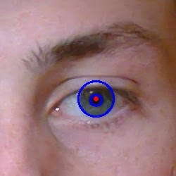
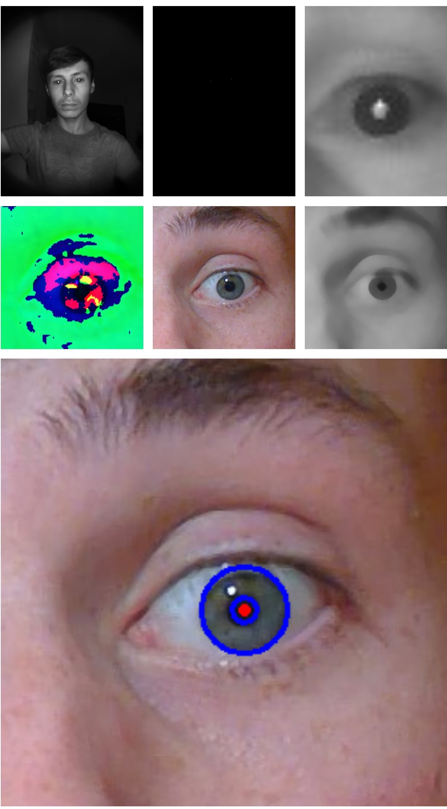
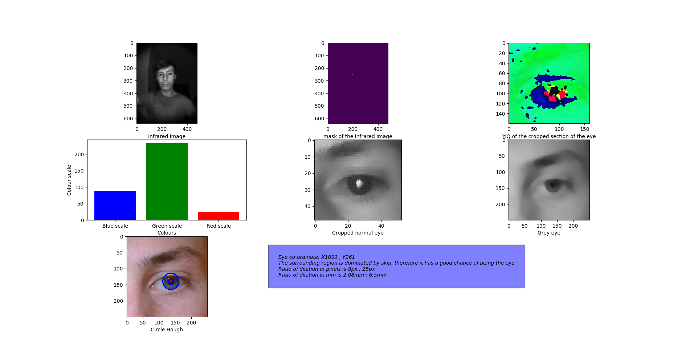

<div>
    </img>
    </img>
    </img>
</div>

# Pupil Dilation Measurement using Near Infrared
### 👁️🔬📏 Pupil Dilation Measurement without Machine Learning  
<br>
You can see the code running with more examples at the colab link below
<br>

<br>
<a href="https://colab.research.google.com/drive/1SD-cjedLl785bp4aa1SYrTp3rcCOdhLA"></a>  

### Prerequisites
```
pip3 install opencv-contrib-python numpy
```
## Algorithm:
1. Load Color and Infrared Images
2. Threshold Infrared Image to help locate eyes
3. Get infrared co-ordinates for an eye
4. Convert co-ordinates to lie on Color Plane
5. Convert image to YIQ for skin detection
6. Use this to verify that co-ordinates point to an eye
7. Create a sub-image containing only the eye
8. Detect Pupil and Iris using Circle Hough
9. Deduce ratio and dilation from measurements
10. Display Stats, Graphs and Images

### Steps as Images


## How Images Were Captured
I wrote a C# application to capture from both the Front Camera and Backlit Near-Infrared Camera simultaneously.  
An early version of my code can be found [here](https://github.com/KnowledgePending/OpenCV_Surface_Near_Infrared).  
<video controls autoplay loop>
  <source src="https://bryanflood.ie/img/infrared-application.mp4" type="video/mp4">
</video>

## Output of the Code
Along with the actually measurement we display key stats and visualisations.  
  

## Contributors
This was created as team project.  
Authors: [Bryan](https://github.com/KnowledgePending), [Cian](https://github.com/CMorar143) and [Val](https://github.com/ValentinCiceu)